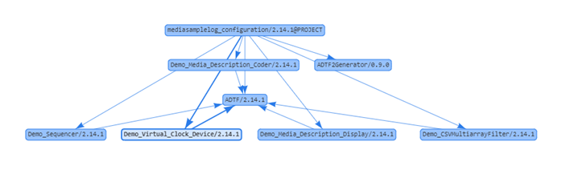
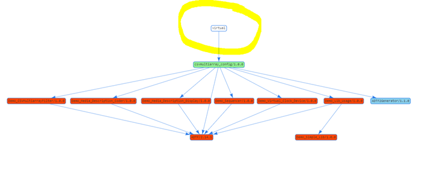
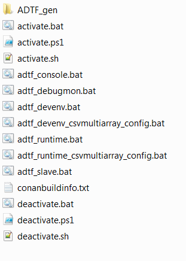
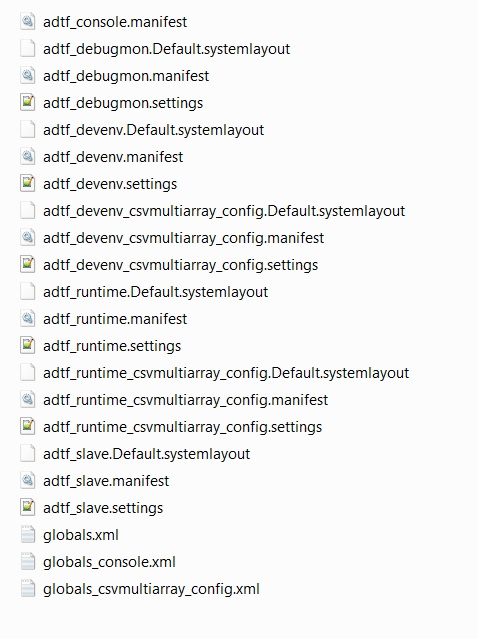
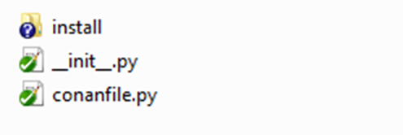
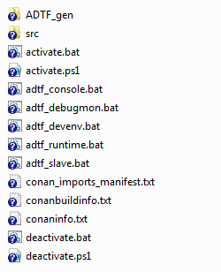

.. Copyright (c) 2019 Audi Electronics Venture GmbH. All Rights Reserved.

.. This Source Code Form is subject to the terms of the Mozilla Public
.. License, v. 2.0. If a copy of the MPL was not distributed with this
.. file, You can obtain one at http://mozilla.org/MPL/2.0/.

General information
+++++++++++++++++++

.. contents::

This is the documentation of a `Conan.io <https://conan.io>`_ generator for ADTF2 Filters, Services, Configurations/Projects, Descriptions, and Custom Launcher Manifests.
See `Conan.io docs <https://docs.conan.io>`_ for more information.

.. note:: The "General/basics" chapter should be read beforehand, especially to facilitate understanding of the functionality.

.. attention:: **Note for usage/compatibility** 
    This generator does NOT work in Conan 1.4.x due to an error in Conan

Prerequisites
*************

This custom Conan generator requires a Conan package named ADTF with major version '2' (e.g. ADTF/2.14.3@<user>/<channel>). 
Sadly we cannot directly provide such a package due to license and distribution permission issues.

Please contact the ADTF distributor Digitalwerk GmbH via support@digitalwerk.net to get a license and download link at least for the ADTF 2 installer packages. 
Probably they may also provide an ADTF 2 Conan package (which is not guaranteed).

Preamble
********

During the Conan install command or the Conan install phase, a Conan generator generates files with different content depending on the generator, e.g. package directories. Most generators use the information defined in the package_info(). This method is the only and official point for providing information to other packages and generators. Effectively, it is the only official information interface regarding package content.

**The basic problem during development with Conan:**

The information from the `package_info()` method is only available to packages in the local_cache, as the `package_info()` method is only executed for packages already generated. Often, this method also includes a reference/path information to `package_folder`, e.g. for defining paths to libraries. The package_folder, however, is only really known and available in the local_cache.

Conclusion
**********

This means that generators can only collect information from packages in the `local_cache`. If this is considered with regard to the development of an individual package (e.g. a library, an ADTF filter), generators can only determine the information of all dependencies and write this to different files (e.g. the CMake generator generates a conanbuildinfo.cmake with paths to all dependencies). There is only limited access to the information of the own product, though.

Application example
*******************

**local development:** `conan install . <other_settings_options_flags>` loads the recipe from the current directory, installs all dependencies, and generates data according to the current generators; which then, however, do NOT (cannot) access the `package_info()` of the current recipe, because the product itself has not yet been built or at least checked out (if recipe is not in the same repository). This is completely sufficient for the development of a package, as all dependencies were installed and referenced in the generated files. This means that development can start.

#. `conan install <...>` - install dependencies and generate files
#. `conan source <...>` - download/check out sources (if required)
#. `conan build <...>` - build sources
#. ...

**Installing a reference:** `conan install <myReference/1.2.3@user/channel> <other_settings_options_flags>` fundamentally acts in a similar manner to that described in *"local development"*. The difference, however, is that Conan internally defines a "virtual" local project reference that depends on the package.
The difference is best illustrated with the Conan info command for generating a graph:

This means that the `package_info()` method and the contained information can be accessed only in the second case.

Use cases covered by the ADTF2Generator
++++++++++++++++++++++++++++++++++++++++

The ADTF2Generator uses the official package description (`package_info()`) to determine all paths to relevant dependencies, and generates all required files (ADTF manifests, globals.xml and start scripts) for each ADTF configuration. To do this, the packages have to provide the information explicitly, i.e. an ADTF plugin package has to explicitly define the paths to the `.plb` files, an ADTF service package has to explicitly define the paths to the `*.manifest` , an ADTF configuration has to explicitly define the paths to the `*.prj` and/or `system.xml` file, as well as other optional settings. Automatic determining of paths (e.g. by mindlessly searching all packages for `*.plb` or `*.manifest` or `*.prj`) was omitted, as libraries or executables also have to be defined explicitly in Conan.

Installing and starting a published ADTF configuration
******************************************************

The user wants to download an already published ADTF configuration to their own computer and start it. It therefore has to be ensured that all dependencies that use the package_info() to explicitly identify themselves as ADTF filter, ADTF service and/or ADTF configuration, are determined and that their paths are correctly entered into the files to be generated.

The user has to execute the following command (using the example of csvmultiarray_config):

.. code-block:: bash

    # Windows command using Visual Studio 2010 binaries
    conan install csvmultiarray_config/1.0.0@CoRTEX/stable -g ADTF2Generator -s compiler="Visual Studio" -s compiler.version=10
    # Linux command using gcc 4.6 binaries
    conan install csvmultiarray_config/1.0.0@CoRTEX/stable -g ADTF2Generator -s compiler=gcc -s compiler.version=4.6

All dependencies are processed and downloaded and the ADTF2Generator generates the following files in the current working directory:

These data are generated in ADTF_gen:

Now, the user can execute one of the generated `adtf_*.bat` or `adtf_*.sh` files in the following step, and ADTF is started. If necessary, additional parameters, e.g. `-run` or `-stdout`, can be transferred to the generated start scripts. These parameters are transferred directly to ADTF.

.. code-block:: bash

    adtf_devenv_csvmultiarray_config.bat -run

The non-project specific files (e.g. `adtf_devenv.bat`, `adtf_runtime.bat`) are generated without a project reference. This means that, while the dependencies from the ADTF services and ADTF filters are included, no project is loaded. This is interesting/relevant in particular if the filters of the current dependency graph are to be used to generate/load a new configuration, or if the developer wants to edit a configuration checked out from the SCM system (see second use case).

Editing a local ADTF configuration
**********************************

Based on the fundamental problem in Conan described above, start scripts can only be generated directly for ADTF configurations that are published or are located in the local_cache.

Nevertheless, the ADTF2Generator also generates more or less universal start scripts based on the dependency graphs for the Conan file to be processed. The prerequisite for this is of course a clear and correct definition of the dependencies (required ADTF filters, ADTF services, etc.) and that these provide the `package_info()` according to the requirements.

The developer would work as follows (assuming that he is in the directory of the Conan recipe for the ADTF configuration):

.. code-block:: bash

    # create a working directory
    current_recipe_dir> mkdir _install
    # change into the working directory
    current_recipe_dir> cd _install
    # call conan install with the ADTF2Generator and other settings and options
    current_recipe_dir\_install> conan install .. -g ADTF2Generator -s compiler.version=10 -s compiler="Visual Studio" <additional_options_settings_flags>
    # call conan source to get the ADTF configuration from SCM system (git clone&checkout or svn checkout)
    current_recipe_dir\_install> conan source .. # if required
    # start the ADTF development environment and MANUALLY open/create a new project
    current_recipe_dir\_install> adtf_devenv.bat

This would be generated as a local working directory

in which the non-project specific start scripts are then generated.

The developer can now create a new ADTF project or change the project checked out from the SCM system.

.. note:: 
    
    ADTF settings should *ALWAYS* be made in the `system.xml`, but *NOT* in the `globals.xml`. The `globals.xml` is regenerated with each generator run, and the settings will therefore be lost.
    For usage of a custom `globals.xml` see "Definition of an ADTF project".

